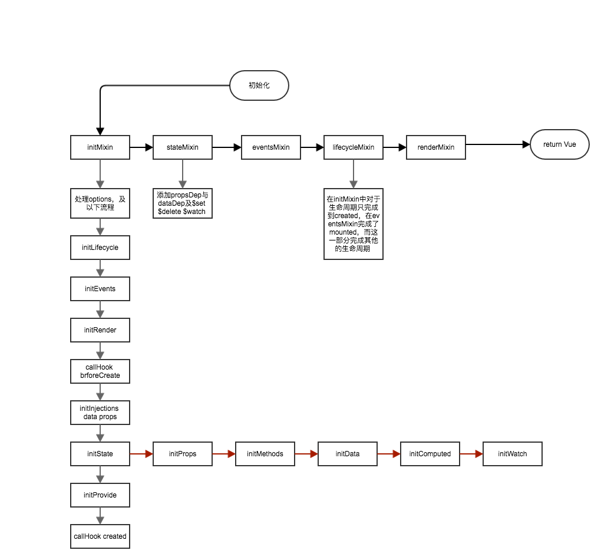

# vue_design

## 为什么是Vue？
1. 轻量级mvvm框架，将开发者从繁琐的dom操作中释放出来
2. 强大的数据跟踪机制，将state与state，state与vnode建立依赖关系，实现一套强大的订阅发布机制
3. vnode中间层，将state与dom通过vnode建立联系，最小粒度最小范围的更新必要的dom

不服跑个分？[传送门](https://rawgit.com/krausest/js-framework-benchmark/master/webdriver-ts/table.html)

## vue
#### 大纲
  
#### initState
  
#### dep,definedProperty,watcher如何工作的？
  
> 以上细节仅供参考，但是大致原理如上，确实不太清楚为什么每次get一个computed都需要重新收集依赖，可能是有些细节没注意到吧

看会儿笔记？  
[vue](.vue.md)  
[vuex初体验](./vuex.md)  
[vueRouter初体验](./vuerouter.md)  
[vueTouch初体验](./vuetouch.md)
